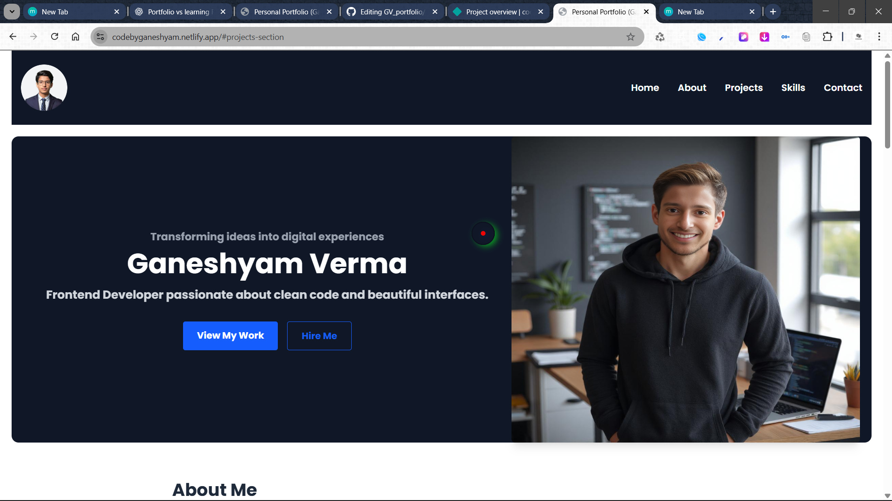

# 🚀 Portfolio Website - **Ganeshyam Verma**



---

## 🔍 **Overview**

Welcome to my personal portfolio website!  
I am **Ganeshyam Verma**, a passionate **Frontend Developer** dedicated to crafting clean, responsive, and user-friendly web interfaces.

This portfolio showcases my skills, projects, and contact information — a snapshot of what I can offer to potential employers and clients.

---

## 🛠️ **Technologies Used**

- **HTML5**  
- **CSS3 & Tailwind CSS**  
- **JavaScript (ES6+)**  
- **Bootstrap 5**  
- **AOS (Animate On Scroll)** for smooth animations  
- Custom media queries for responsiveness

---

## 🎯 **Features**

- Fully **responsive design** — looks great on all screen sizes  
- Smooth **scrolling navigation**  
- Interactive **project cards** with live demo links  
- Custom **cursor animation** for unique UX  
- Contact form integrated with **Formspree** for easy inquiries

---

## 📁 **Project Structure**

```plaintext
/
├── assets/
│   ├── homepage-ss.png
│   ├── profile-picture.png
│   └── ...other images
├── index.html
├── main.css
├── main.js
└── README.md
📬 Contact Me
Feel free to reach out for collaborations, freelance projects, or just to say hi!

📧 wid2839@gmail.com

🔗 GitHub Profile

🔗 LinkedIn Profile

📌 Live Demo
Check out the live site here:
🌐 https://codebyganeshyam.netlify.app/

⭐ Feedback & Contributions
If you find this portfolio useful or have suggestions, please open an issue or reach out. Contributions and feedback are always welcome!

Thank you for visiting! 🙏
— Ganeshyam Verma
